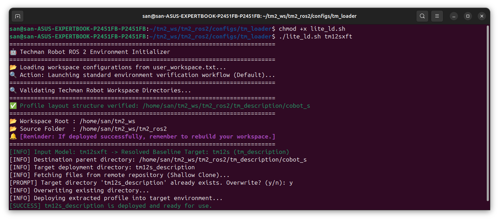
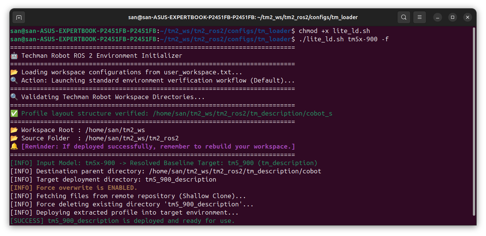

# TM_Cobots_ROS2_Description

:bookmark_tabs: TM ROS2 version **<ins>Jazzy or higher</ins>** is strictly required to support the TM Robots Series directory structure syntax.

This repository provides official ROS 2 description files (URDF/Xacro) and 3D meshes for the **TM AI Cobot S** and **TM AI Cobot** series. It supports various configurations, including Standard, Standard-X, FT module, and FT-X for robot visualization (**RViz**), simulation (**Gazebo**), and motion planning (**MoveIt 2**).

- [Usage Guideline](./tm_description/TM_Cobots_ROS2_Description.md)

Additionally, this guide (below) details **how to migrate these standalone description packages into a legacy `tm2_ros2` workspace**.

---

## Robot Models Quick Reference Table

For a comprehensive configuration matrix (Standard, Standard-X, FT, and FT-X) across all supported TM Robot Series models, please refer to the dropdown below:

<details>
<summary>👁️ Click to expand/collapse the Supported Robot Models Matrix</summary>

<br>

|  | Series | Standard | Standard-X | FT Module | FT-X Module |
| :--- | :--- | :---: | :---: | :---: | :---: |
| **TM AI Cobot S Series** | **TM5S** | TM5S | TM5SX | TM5SFT | TM5SXFT |
| | **TM6S** | TM6S | TM6SX | TM6SFT | TM6SXFT |
| | **TM7S** | TM7S | TM7SX | TM7SFT | TM7SXFT |
| | **TM12S** | TM12S | TM12SX | TM12SFT | TM12SXFT |
| | **TM14S** | TM14S | TM14SX | TM14SFT | TM14SXFT |
| | **TM20S** | TM20S | TM20SX | TM20SFT | TM20SXFT |
| | **TM25S** | — | — | TM25SFT | TM25SXFT |
| | **TM30S** | — | — | TM30SFT | TM30SXFT |
| **TM AI Cobot Series** | **TM5-700** | TM5-700 | TM5X-700 | — | — |
| | **TM5-900** | TM5-900 | TM5X-900 | — | — |
| | **TM12** | TM12 | TM12X | — | — |
| | **TM14** | TM14 | TM14X | — | — |
| | **TM16** | TM16 | TM16X | — | — |
| | **TM20** | TM20 | TM20X | — | — |

> 💡 **Note:** The Robot Models packages are continuously updated and deployed to this repository.

</details>

---

## Migration & Deployment Guide

This guide explains how to migrate robot description files for the **TM AI Cobot S Series** into the legacy `tm2_ros2` workspace.

> 💡 **Note:** The legacy repository only includes the `tm12s` and `tm5-900` profiles by default. Other needed profiles must be retrieved from the standalone [TM_Cobots_ROS2_Description](https://github.com/TechmanRobotInc/TM_Cobots_ROS2_Description) repository.

For more detailed information, please refer to [Migration & Deployment Usage Guideline](./Migration_and_Deployment_Guide.md).

### Quick Start with Examples

Run the `lite_ld.sh` script to install the specific cobot description files into the `tm2_ros2` workspace.

* **Example 1: Standard Installation**  
  Install TM12SXFT description files:
  ```bash
  ./lite_ld.sh tm12sxft
  ```
  

* **Example 2: Forced Overwrite**  
  Install TM5X-900 description files. Use the force flag (`-f`) to overwrite existing legacy files without confirmation:
  ```bash
  ./lite_ld.sh tm5x-900 -f
  ```
  
