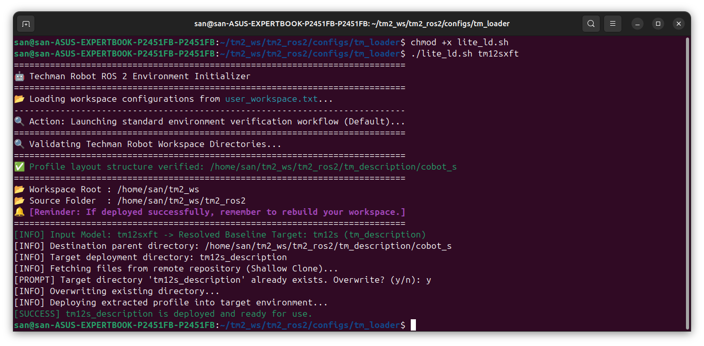
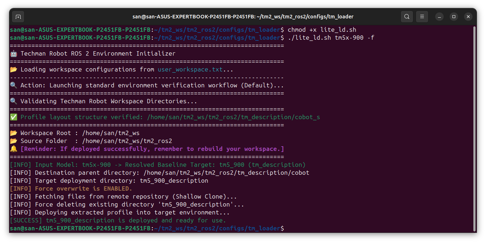

# TM_Cobots_ROS2_Description

:bookmark_tabs: TM ROS2 version **<ins>Jazzy or higher</ins>** is strictly required to support the TM Cobots Series directory structure syntax.

This repository provides official ROS 2 description files (URDF/Xacro) and 3D meshes for the **TM AI Cobot S** and **TM AI Cobot** series. It supports various configurations, including Standard, Standard-X, FT, and FT-X modules for robot visualization (**RViz2**), simulation (**Gazebo**), and motion planning (**MoveIt 2**).

For more detailed information, please refer to [TM_Cobots_ROS2_Description Usage Guideline](./tm_description/TM_Cobots_ROS2_Description.md).

Additionally, the following guide describes **how to migrate these standalone description packages into a legacy `tm2_ros2` workspace**.

---

## Cobot Models Quick Reference Table

💡 You can find the full list of downloadable cobot models in the table below:

<details>
<summary>👁️ Click to expand/collapse the Supported Cobot Models Matrix</summary>

<br>

The configuration matrix below maps all supported TM Robot Series models across Standard, Standard-X, FT, and FT-X variants:

<table>
  <thead>
    <tr>
      <th rowspan="2"></th>
      <th rowspan="2">Series</th>
      <th colspan="4" style="text-align: center;">Xacro model name</th>
    </tr>
    <tr>
      <th style="text-align: center;">Standard</th>
      <th style="text-align: center;">Standard-X</th>
      <th style="text-align: center;">FT</th>
      <th style="text-align: center;">FT-X</th>
    </tr>
  </thead>
  <tbody>
    <tr>
      <td><b>TM AI Cobot S Series</b></td>
      <td><b>TM5S</b></td>
      <td align="center">TM5S</td>
      <td align="center">TM5SX</td>
      <td align="center">TM5SFT</td>
      <td align="center">TM5SXFT</td>
    </tr>
    <tr>
      <td></td>
      <td><b>TM6S</b></td>
      <td align="center">TM6S</td>
      <td align="center">TM6SX</td>
      <td align="center">TM6SFT</td>
      <td align="center">TM6SXFT</td>
    </tr>
    <tr>
      <td></td>
      <td><b>TM7S</b></td>
      <td align="center">TM7S</td>
      <td align="center">TM7SX</td>
      <td align="center">TM7SFT</td>
      <td align="center">TM7SXFT</td>
    </tr>
    <tr>
      <td></td>
      <td><b>TM12S</b></td>
      <td align="center">TM12S</td>
      <td align="center">TM12SX</td>
      <td align="center">TM12SFT</td>
      <td align="center">TM12SXFT</td>
    </tr>
    <tr>
      <td></td>
      <td><b>TM14S</b></td>
      <td align="center">TM14S</td>
      <td align="center">TM14SX</td>
      <td align="center">TM14SFT</td>
      <td align="center">TM14SXFT</td>
    </tr>
    <tr>
      <td></td>
      <td><b>TM20S</b></td>
      <td align="center">TM20S</td>
      <td align="center">TM20SX</td>
      <td align="center">TM20SFT</td>
      <td align="center">TM20SXFT</td>
    </tr>
    <tr>
      <td></td>
      <td><b>TM25S</b></td>
      <td align="center">—</td>
      <td align="center">—</td>
      <td align="center">📌 TM25SFT</td>
      <td align="center">📌 TM25SXFT</td>
    </tr>
    <tr>
      <td></td>
      <td><b>TM30S</b></td>
      <td align="center">—</td>
      <td align="center">—</td>
      <td align="center">📌 TM30SFT</td>
      <td align="center">📌 TM30SXFT</td>
    </tr>
    <tr>
      <td><b>TM AI Cobot Series</b></td>
      <td><b>TM5-700</b></td>
      <td align="center">TM5-700</td>
      <td align="center">TM5X-700</td>
      <td align="center">—</td>
      <td align="center">—</td>
    </tr>
    <tr>
      <td></td>
      <td><b>TM5-900</b></td>
      <td align="center">TM5-900</td>
      <td align="center">TM5X-900</td>
      <td align="center">—</td>
      <td align="center">—</td>
    </tr>
    <tr>
      <td></td>
      <td><b>TM12</b></td>
      <td align="center">TM12</td>
      <td align="center">TM12X</td>
      <td align="center">—</td>
      <td align="center">—</td>
    </tr>
    <tr>
      <td></td>
      <td><b>TM14</b></td>
      <td align="center">TM14</td>
      <td align="center">TM14X</td>
      <td align="center">—</td>
      <td align="center">—</td>
    </tr>
    <tr>
      <td></td>
      <td><b>TM16</b></td>
      <td align="center">TM16</td>
      <td align="center">TM16X</td>
      <td align="center">—</td>
      <td align="center">—</td>
    </tr>
    <tr>
      <td></td>
      <td><b>TM20</b></td>
      <td align="center">TM20</td>
      <td align="center">TM20X</td>
      <td align="center">—</td>
      <td align="center">—</td>
    </tr>
  </tbody>
</table>

<br>

> 📌 **Xacro Model Name to New Official TM Robot Name Mapping:**<br>
> Simply strip the `FT` suffix to get the official model name (e.g., `TM25SFT` → **TM25S**, `TM30SXFT` → **TM30SX**).<br>

</details>

---

## Migration & Deployment Guide

You can use the usual method to download and copy the required robot description files to the correct relative location within your workspace, or you can use the guide below to migrate the **TM AI Cobot / Cobot S Series** robot description files into the legacy `tm2_ros2` workspace via the script method.

For more detailed information, please refer to [Migration & Deployment Usage Guideline](./Migration_and_Deployment_Guide.md).

<details>
<summary>👁️ Click to expand/collapse the brief description</summary>

<br>

This guide explains how to migrate robot description files for the **TM AI Cobot S Series** into the legacy `tm2_ros2` workspace.

> 💡 **Note:** The legacy repository only includes the `tm12s` and `tm5-900` profiles by default. Other needed profiles must be retrieved from the standalone [TM_Cobots_ROS2_Description](https://github.com/TechmanRobotInc/TM_Cobots_ROS2_Description) repository.

</details>

### Quick Start with Examples

Run the `lite_ld.sh` script to install the specific cobot description files into the `tm2_ros2` workspace.

For more script information, please refer to [Loader Script Guide](https://github.com/TechmanRobotInc/tm2_ros2/tree/jazzy/configs/tm_loader/README.md).

* **Example: Standard Installation**  
  Install TM12SXFT description files:
  ```bash
  ./lite_ld.sh tm12sxft
  ```
  

<details>
<summary>👁️ Click to expand/collapse the Forced Overwrite example</summary>

<br>

* **Example: Forced Overwrite**  
  Install TM5X-900 description files. Use the force flag (`-f`) to overwrite existing legacy files without confirmation:
  ```bash
  ./lite_ld.sh tm5x-900 -f
  ```
  

</details>
